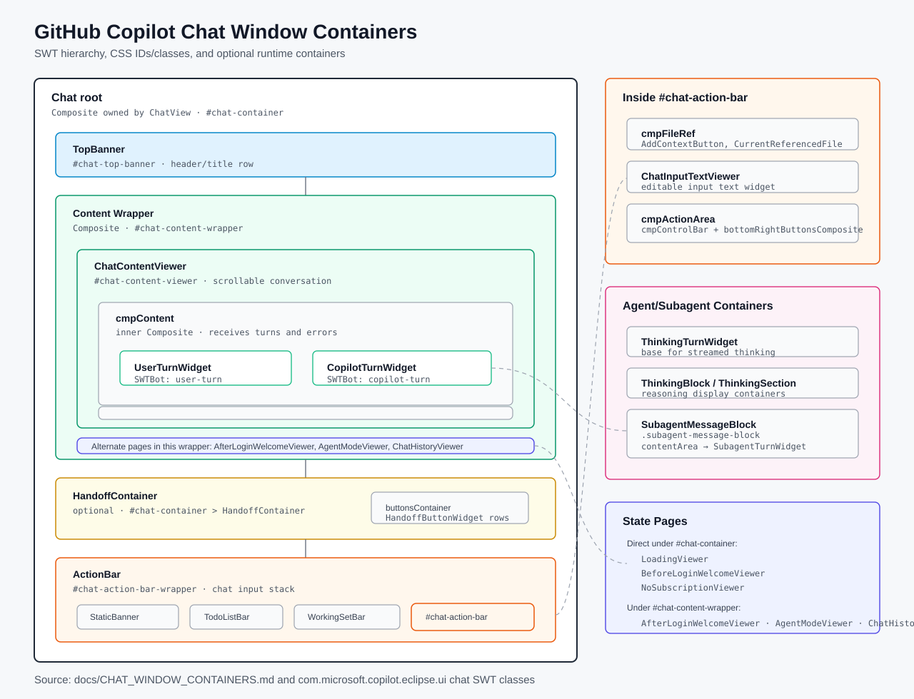

# GitHub Copilot Chat Window Containers

This document maps the main SWT containers that make up the GitHub Copilot chat window. Styling is applied through Eclipse e4 CSS data keys:



- CSS class key: `CssConstants.CSS_CLASS_NAME_KEY`
- CSS ID key: `CssConstants.CSS_ID_KEY`

## Root Layout

| Container | Java type | CSS selector / key | Purpose | Source |
| --- | --- | --- | --- | --- |
| Chat root | `Composite` owned by `ChatView` | `#chat-container` | Root container for the Copilot chat view. All top-level chat UI is attached here. | `ChatView#createPartControl` |
| Top banner | `TopBanner` | `#chat-top-banner` | Header/title area at the top of the chat view. | `TopBanner` |
| Content wrapper | `Composite` | `#chat-content-wrapper` | Hosts the active central page: conversation, welcome page, agent mode page, or chat history. | `ChatView#createContentWrapper` |
| Handoff container | `HandoffContainer` | Styled by `#chat-container > HandoffContainer` | Optional container shown above the input area when the current mode exposes handoff actions. | `ChatView#createHandoffContainer`, `HandoffContainer` |
| Action bar wrapper | `ActionBar` | `#chat-action-bar-wrapper` | Outer wrapper for the chat input stack. | `ChatView#createActionBar`, `ActionBar` |

Typical signed-in chat/agent layout:

```text
#chat-container
  TopBanner              (#chat-top-banner)
  Composite              (#chat-content-wrapper)
    ChatContentViewer    (#chat-content-viewer)
      Composite          (cmpContent)
        UserTurnWidget
        CopilotTurnWidget
  HandoffContainer       (optional)
  ActionBar              (#chat-action-bar-wrapper)
```

## Conversation Content

| Container | Java type | CSS selector / key | Purpose | Source |
| --- | --- | --- | --- | --- |
| Conversation scroller | `ChatContentViewer` | `#chat-content-viewer` | Scrollable conversation surface. | `ChatContentViewer` |
| Turn list content | `Composite` field `cmpContent` | Styled through `#chat-content-viewer > Composite` | Inner content composite that receives turn widgets and error widgets. | `ChatContentViewer` |
| User message container | `UserTurnWidget` | SWTBot key `user-turn`; styled by `#chat-content-viewer > Composite > UserTurnWidget` | One user chat turn. Extends `BaseTurnWidget`. | `UserTurnWidget` |
| Copilot reply container | `CopilotTurnWidget` | SWTBot key `copilot-turn`; styled by `#chat-content-viewer > Composite > CopilotTurnWidget` | One Copilot chat turn. Extends `ThinkingTurnWidget` and supports thinking/model footer content. | `CopilotTurnWidget` |
| Shared turn container | `BaseTurnWidget` | No direct CSS ID | Shared base layout for user, Copilot, and subagent turns. Creates avatar/title row and text/code/warning/tool content. | `BaseTurnWidget` |
| Message text | `StyledText` from `SourceViewer` / `ChatMarkupViewer` | `.chat-message-text` | Rendered text content inside a turn. | `UserTurnWidget`, `ChatMarkupViewer` |
| Code block container | `SourceViewerComposite` | No direct CSS ID | Rendered code block inside a turn. | `BaseTurnWidget#createCodeBlock` |
| Warning container | `WarnWidget` | No direct CSS ID | Inline warning or quota/error warning inside a turn. | `BaseTurnWidget#createWarnDialog` |
| Error container | `ErrorWidget` | No direct CSS ID | Error banner rendered inside the conversation content list. | `ChatContentViewer#renderErrorMessage` |
| Tool confirmation container | `InvokeToolConfirmationDialog` | `.bg-command-panel`, `.btn-primary` for child styling | Inline tool invocation confirmation inside a Copilot turn. | `BaseTurnWidget`, `InvokeToolConfirmationDialog` |

## Handoff Area

| Container | Java type | CSS selector / key | Purpose | Source |
| --- | --- | --- | --- | --- |
| Handoff container | `HandoffContainer` | Styled by `#chat-container > HandoffContainer` | Shows mode handoff options, hidden when no handoffs exist. | `HandoffContainer` |
| Handoff label | `Label` | `.text-secondary` | Text label such as `PROCEED FROM ...`. | `HandoffContainer#show` |
| Handoff buttons row | `Composite` local `buttonsContainer` | No direct CSS ID | Row-layout container for handoff buttons. | `HandoffContainer#show` |
| Handoff button | `HandoffButtonWidget` | No direct CSS ID | Individual handoff action button. | `HandoffButtonWidget` |

## Chat Input Area

| Container | Java type | CSS selector / key | Purpose | Source |
| --- | --- | --- | --- | --- |
| Action bar wrapper | `ActionBar` | `#chat-action-bar-wrapper` | Outer input stack, including optional banners and bars. | `ActionBar` |
| Static banner | `StaticBanner` | No direct CSS ID | Optional warning/info banner displayed above the input area. | `ActionBar#showStaticBanner`, `StaticBanner` |
| Input area | `Composite` field `inputArea` | No direct CSS ID | Transparent wrapper for optional todo/working-set bars and the bordered input. | `ActionBar` |
| Todo list bar | `TodoListBar` | `#todo-list-title` for title child | Optional task list bar shown above the input when agent todo data exists. | `TodoListService`, `TodoListBar` |
| Working set bar | `WorkingSetBar` | Uses `#file-row` / `#file-row-hover` for file rows | Optional changed-files summary bar shown above the input. | `FileToolService`, `WorkingSetBar` |
| Bordered input container | `Composite` local `borderedActionBar` | `#chat-action-bar` | Visual input box containing references, text input, and bottom controls. | `ActionBar` |
| References row | `Composite` field `cmpFileRef` | No direct CSS ID | Holds `AddContextButton`, current file reference, and referenced files. | `ActionBar` |
| Add context control | `AddContextButton` | No direct CSS ID | Button for adding context/references. | `ActionBar`, `AddContextButton` |
| Current file reference | `CurrentReferencedFile` | Child labels use `.text-secondary` | Shows current referenced file state. | `ActionBar`, `CurrentReferencedFile` |
| Referenced file item | `ReferencedFile` | `#normal-referenced-file-name`, `#not-supported-referenced-file-name` for filename label | Individual referenced file pill/item. | `ReferencedFile` |
| Chat input text | `ChatInputTextViewer` | Child text widget may receive CSS classes through `CssConstants.CSS_CLASS_NAME_KEY` | Actual editable chat input. | `ActionBar`, `ChatInputTextViewer` |
| Action area | `Composite` field `cmpActionArea` | No direct CSS ID | Bottom row of controls under the text input. | `ActionBar` |
| Control bar | `Composite` local `cmpControlBar` | No direct CSS ID | Left-side controls: chat mode, model picker, breakpoint, MCP tools, context-size donut. | `ActionBar` |
| Right button group | `Composite` field `bottomRightButtonsComposite` | No direct CSS ID | Right-side send/cancel/job buttons. | `ActionBar` |

## Welcome, Loading, And History Pages

These are mutually exclusive content pages hosted either directly under `#chat-container` or inside `#chat-content-wrapper`, depending on authentication and chat state.

| Container | Java type | CSS selector / key | Purpose | Source |
| --- | --- | --- | --- | --- |
| Loading page | `LoadingViewer` | Styled by `#chat-container > LoadingViewer` | Initial loading state while chat services initialize. | `ChatView#createLoadingPage` |
| Before-login welcome page | `BeforeLoginWelcomeViewer` | Styled by `#chat-container > BeforeLoginWelcomeViewer` | Signed-out welcome/sign-in page. | `ChatView#createBeforeLoginWelcomePage` |
| No-subscription page | `NoSubscriptionViewer` | Styled by `#chat-container > NoSubscriptionViewer` | Signed-in but no usable Copilot subscription state. | `ChatView#createNoSubscriptionPage` |
| After-login welcome page | `AfterLoginWelcomeViewer` | Styled by `#chat-content-wrapper > AfterLoginWelcomeViewer` | Default empty chat welcome page. | `ChatView#createAfterLoginWelcomePage` |
| Agent mode page | `AgentModeViewer` | Styled by `#chat-content-wrapper > AgentModeViewer` | Empty agent-mode landing page. | `ChatView#createAgentModePage` |
| Chat history page | `ChatHistoryViewer` | `#chat-history-viewer` | Conversation history list. | `ChatView#showChatHistory`, `ChatHistoryViewer` |

## Agent And Subagent Containers

| Container | Java type | CSS selector / key | Purpose | Source |
| --- | --- | --- | --- | --- |
| Thinking turn | `ThinkingTurnWidget` | No direct CSS ID | Turn type that supports streamed thinking blocks. | `ThinkingTurnWidget` |
| Thinking block | `ThinkingBlock` | Child labels use `.text-secondary` | Collapsible/rendered thinking content within a Copilot turn. | `ThinkingBlock` |
| Thinking section | `ThinkingSection` | No direct CSS ID | Rendered section within a thinking block. | `ThinkingSection` |
| Agent status label | `AgentStatusLabel` | Child labels use `.text-secondary` | Displays agent/tool progress status. | `BaseTurnWidget#appendToolCallStatus`, `AgentStatusLabel` |
| Agent tool cancel label | `AgentToolCancelLabel` | Child label uses `.text-secondary` | Cancellation/status label for agent tool execution. | `AgentToolCancelLabel` |
| Agent message widget | `AgentMessageWidget` | Buttons use `.btn-primary` / `.btn-secondary` | Rendered GitHub coding-agent/job message. | `BaseTurnWidget#appendAgentMessage` |
| Subagent block | `SubagentMessageBlock` | `.subagent-message-block` | Bordered container for subagent execution within a Copilot turn. | `SubagentMessageBlock` |
| Subagent content area | `Composite` field `contentArea` | Styled through `.subagent-message-block > Composite` | Inner container for the subagent turn widget. | `SubagentMessageBlock` |
| Subagent turn | `SubagentTurnWidget` | Styled through `.subagent-message-block > Composite > SubagentTurnWidget` | Turn widget used inside a subagent block. | `SubagentTurnWidget` |

## Primary Theme Selectors

The main chat containers are styled in `com.microsoft.copilot.eclipse.ui/css/light.css` and `com.microsoft.copilot.eclipse.ui/css/dark.css`.

Important selectors:

```css
#chat-container
#chat-top-banner
#chat-content-wrapper
#chat-action-bar-wrapper
#chat-action-bar
#chat-container > HandoffContainer
#chat-content-viewer
#chat-content-viewer > Composite
#chat-content-viewer > Composite > UserTurnWidget
#chat-content-viewer > Composite > CopilotTurnWidget
#chat-content-viewer StyledText.chat-message-text
#chat-content-viewer .chat-message-text
#chat-content-viewer > Composite > CopilotTurnWidget > .subagent-message-block
#chat-history-viewer
#file-row
#file-row-hover
#todo-list-title
```
